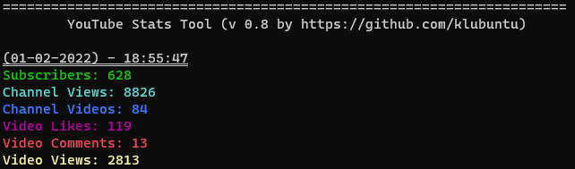
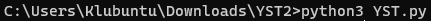
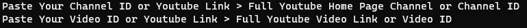
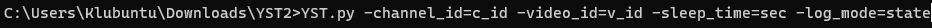
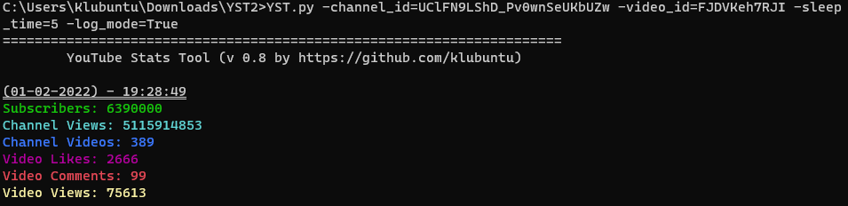

# 📺 YouTube Stats Tool (YST)



Command-line tool that tracks live YouTube channel and video statistics and logs
them to disk, so you can see how your numbers change over time.

## 📖 Description

YST queries the official YouTube Data API v3 and, on a configurable interval,
refreshes:

| Channel statistics | Video statistics        |
| ------------------ | ----------------------- |
| Subscribers        | Views                   |
| Total views        | Likes                   |
| Video count        | Comments                |

Two ways of running it:

- **Interactive** – start the script and paste a channel and a video link or ID when prompted.
- **Command line** – pass every value as an argument (handy for scripts and scheduled tasks).

The tool is also shipped as a Windows executable, so Python is not required to use it.

## ⚙️ Requirements

- **Python 3.8+** – [download](https://www.python.org/downloads/release/python-3810/)
  — or use the compiled Windows build below.
- **`requests`** – YouTube Data API calls.
- **`colorama`** – ANSI colors, including native support in the classic Windows Command Prompt.
- **A YouTube Data API key** – read from the `YOUTUBE_API_KEY` environment variable, falling back
  to the key in `src/YST_lib/required.py`.
- **Windows only** – for the pre-built `.exe` release.

## 📥 Installation

### Option A – Windows executable (no Python needed)

- [Download `YST.exe` from the repository](https://github.com/Klubuntu/YST/raw/main/dist/YST.exe)
- or grab it from the [v0.8 release page](https://github.com/Klubuntu/YST/releases/download/v0.8/YST.exe)

Double-click the file and follow the prompts.

### Option B – Run from source

```bash
# 1. Get the code (branch: main)
git clone https://github.com/Klubuntu/YST.git
cd YST

# 2. Create a virtual environment (recommended)
python -m venv .venv
.venv\Scripts\activate        # Windows
source .venv/bin/activate     # Linux / macOS

# 3. Install dependencies
pip install -r requirements.txt
```

Alternatively, [download the code as a ZIP](https://github.com/Klubuntu/YST/archive/refs/heads/main.zip).

## ⚙️ Configuration

The API key is read from the `YOUTUBE_API_KEY` environment variable, falling
back to the built-in key. Copy `.env.example` to `.env` next to the working
directory to set it there instead of exporting it for every run:

```
# .env
YOUTUBE_API_KEY=your-key-here
```

An environment variable always wins over `.env`. Invalid keys, exhausted quota,
a disabled API and rate limiting are reported with a message explaining what to
do, rather than an HTTP error.

## 🚀 Usage

### Interactive mode

1. Run the tool and paste the requested values when prompted:

   ```bash
   python src\YST.py
   ```

   On start-up the tool prints its ASCII banner:

   ```text
    __  _____________
    \ \/ / ___/_  __/
     \  /\__ \ / /
     / /___/ // /
    /_//____//_/
   ```

   

2. Enter the required details:

   

   Accepted inputs:

   | Field              | Example                                                                                      |
   | ------------------ | -------------------------------------------------------------------------------------------- |
   | Full channel URL   | `https://www.youtube.com/c/ThatLittlePuff` · `https://www.youtube.com/channel/UClFN9LShD_Pv0wnSeUKbUZw` |
   | Channel ID         | `UClFN9LShD_Pv0wnSeUKbUZw`                                                                    |
   | Channel handle     | `@ThatLittlePuff`                                                                             |
   | Full video URL     | `https://www.youtube.com/watch?v=C7REVNM_EWY` · `https://youtu.be/C7REVNM_EWY`                |
   | Video ID           | `C7REVNM_EWY`                                                                                 |

### Sub-commands

Shortcuts for the frequent runs. Each one expands to the flags shown, and every
option still works afterwards:

| Command             | Equivalent to                                                       |
| ------------------- | ------------------------------------------------------------------- |
| `video <ID>`        | `-video_id=<ID>` (channel is asked for)                              |
| `channel <ID>`      | `-channel_id=<ID> -latest_video=True`                                |
| `latest <ID>`       | `-channel_id=<ID> -latest_video=True`                                |
| `monitor <ID>`      | `-channel_id=<ID> -latest_video=True -log_mode=True`                 |
| `compare <ID...>`   | `-compare=<ID1,ID2,...>`                                             |
| `export <ID>`       | `-channel_id=<ID> -export=csv`                                       |

```bash
python src/YST.py --help
python src/YST.py monitor UCifZaTQPiHE2QRgEwDNfhug -sleep_time=60 -dashboard=True
python src/YST.py compare C7REVNM_EWY Xknt3_QJY7o
```

### Command-line mode

Pass all arguments at once:

```bash
python src\YST.py -channel_id=UClFN9LShD_Pv0wnSeUKbUZw -video_id=FJDVKeh7RJI -sleep_time=5 -log_mode=True
```



#### Arguments

| Argument       | Type           | Default | Description                                        |
| -------------- | -------------- | ------- | -------------------------------------------------- |
| `-channel_id`  | string         | —       | Channel ID, `@handle`, or channel URL               |
| `-video_id`    | string         | —       | Video ID or video URL                               |
| `-sleep_time`  | int (seconds)  | `2`     | Delay between two statistic refreshes               |
| `-log_mode`    | `True`/`False` | `False` | Print results to the console instead of only files  |
| `-latest_video`| `True`/`False` | `False` | Fetch the latest video ID from the channel          |
| `-enable_log`  | metric list    | all     | Log only the listed metrics                         |
| `-disable_log` | metric list    | —       | Log everything except the listed metrics            |
| `-list_logs`   | `True`/`False` | `False` | Print the available metric keys and exit            |
| `-snapshot_time` | int (sec)   | `60`    | How often a snapshot is written to the history      |
| `-history`     | int (hours)   | `24`    | Window used by the dashboard and the export         |
| `-dashboard`   | `True`/`False` | `False` | Add the history summary and sparkline to the output  |
| `-db`          | path          | `data/yst.db` | Location of the history database            |
| `-export`      | `csv`/`json`  | —       | Export the stored history and exit                   |
| `-export_path` | path          | `exports` | Folder for exported files                         |
| `-compare`     | video list    | —       | Compare videos side by side and exit               |
| `-compare_channels` | channel list | —    | Compare channels side by side and exit             |
| `-watchlist`   | path          | —       | Monitor every channel listed in a text file        |
| `-chart`       | `True`/`False` | `False` | Draw block charts of the history window            |
| `-report`      | `True`/`False` | `False` | Write an HTML report with SVG charts and exit      |

Values can be attached with `=` or passed as the next token, so
`-sleep_time=5` and `-sleep_time 5` are the same. Boolean flags accept
`true`/`false`, `1`/`0`, `yes`/`no` and `on`/`off`, in any case.

#### Choosing which metrics to log

By default every metric is logged. Narrow it down with `-enable_log`, or keep
everything except a few with `-disable_log` — both take a comma- or
space-separated list:

```bash
# only these two
python src\YST.py -channel_id=UCifZaTQPiHE2QRgEwDNfhug -video_id=C7REVNM_EWY -enable_log subs, video_views

# everything except these two
python src\YST.py -channel_id=UCifZaTQPiHE2QRgEwDNfhug -video_id=C7REVNM_EWY -disable_log subs, video_views
```

| Key              | File                      |
| ---------------- | ------------------------- |
| `subs`           | `channel_subscribers.txt` |
| `channel_views`  | `channel_viewsCount.txt`  |
| `channel_videos` | `channel_videoCount.txt`  |
| `video_views`    | `video_views.txt`         |
| `video_likes`    | `video_likes.txt`         |
| `video_comments` | `video_comments.txt`      |

Short aliases are accepted too (`subscribers`, `views`, `likes`, `comments`,
`videos`, …), keys are case-insensitive, and `-list_logs=True` prints the full
list with its output file. The two flags are mutually exclusive, an unknown
metric stops the tool with the valid names, and the active selection is echoed
on start-up. Disabled metrics are neither written to disk nor printed in
`-log_mode=True`.



> Output is colored through `colorama`, so colors now render in the classic Command Prompt too.
> When stdout is not a terminal (e.g. piped to a file), escape codes are stripped automatically.

### History, deltas and dashboard

Every refresh is stored as a snapshot in a local SQLite database
(`data/yst.db` by default), which makes growth measurable over time. Deltas
appear next to each metric automatically once a second snapshot exists:

```
(01-10-2026) - 19:33:41
Subscribers: 693 (0)
Channel Views: 152 486 (+12)
Video Views: 111 200 (+553)
```

`-dashboard=True` adds a summary of the last `-history` hours with per-hour
rates and a sparkline:

```
Last 24h:
Video Likes: +39 (+2/h)
Video Views: +10 647 (+546/h)
Video Views trend: ▁▁▁▁▁▁▁▁▂▂▂▂▂▃▃▃▄▄▄▅▅▅▆▆▆▇▇█
```

```bash
# monitor a channel and refresh the summary every minute
python src/YST.py -channel_id=UCifZaTQPiHE2QRgEwDNfhug -video_id=C7REVNM_EWY -sleep_time=60 -dashboard=True

# snapshots every 5 minutes into a custom database
python src/YST.py -channel_id=UC... -video_id=... -snapshot_time=300 -db data/mine.db
```

### Export

`-export` writes the stored snapshots and exits, so it costs no API calls:

```bash
# every video of the channel, last 24 hours, default folder
python src/YST.py -channel_id=UCifZaTQPiHE2QRgEwDNfhug -export csv

# one video, last 7 days, into reports/
python src/YST.py -channel_id=UC... -video_id=C7REVNM_EWY -history 168 -export json -export_path reports
```

```csv
recorded_at,channel_id,video_id,subs,channel_views,channel_videos,video_views,video_likes,video_comments
1790883289,UCifZaTQPiHE2QRgEwDNfhug,Xknt3_QJY7o,693,152486,434,43,3,0
```

### Comparing videos

`-compare` fetches up to 50 videos in a single API call and prints their
performance next to each other:

```bash
python src/YST.py -compare C7REVNM_EWY,Xknt3_QJY7o
```

```
     Video        Views      Likes  Comments   Like%  Comment%     Views/h
--------------------------------------------------------------------------------
C7REVNM_EWY     2 827 211    157 438       428   5.57%     0.02%    848.2M/h
Xknt3_QJY7o            43          3         0   6.98%     0.00%        13/h
C7REVNM_EWY = Meow Chef— anyone want to help the cat clean the table? (0:12)
```

`Views/h` is views divided by the video length, so short videos naturally show a
huge rate; it shows `n/a` when a length is unknown. IDs that do not exist are
listed below the table.

### Comparing channels

`-compare_channels` does the same for channels, adding views per video:

```bash
python src/YST.py -compare_channels UClFN9LShD_Pv0wnSeUKbUZw,UCifZaTQPiHE2QRgEwDNfhug
```

```
              Channel              Subs          Views   Videos    Views/video
------------------------------------------------------------------------------------
UCifZaTQPiHE2QRgEwDNfhug          693        152 486      434           351
UClFN9LShD_Pv0wnSeUKbUZw   38 600 000 37 278 025 432    1 290    28 897 694
```

### Watchlist

`-watchlist` monitors several channels at once. The file takes one channel per
line, `#` starts a comment and `@handle` entries are resolved:

```
# watchlist.txt
UClFN9LShD_Pv0wnSeUKbUZw
@ThatLittlePuff
UCifZaTQPiHE2QRgEwDNfhug
```

```bash
python src/YST.py -watchlist watchlist.txt -sleep_time=60 -snapshot_time=300
```

```
UClFN9LShD_Pv0wnSeUKbUZw   subs   38 600 000   views   37 278 025 432   videos    1 290
UCifZaTQPiHE2QRgEwDNfhug   subs          693   views          152 486   videos      434
```

Each channel gets its own snapshots in the history database, and channels that
resolve to the same ID are only fetched once. Channels that hide their
subscriber count show `hidden` instead of a misleading zero — the same applies
to the single-channel view.

### Charts and HTML report

`-chart=True` draws block charts of the selected window next to the dashboard,
while the one-line sparkline stays for a quick look:

```bash
python src/YST.py monitor UCifZaTQPiHE2QRgEwDNfhug -dashboard=True -chart=True -history=168
```

`-report=True` writes a self-contained HTML file to the export folder with one
SVG line chart per metric, the min/max range and a table of the stored values:

```bash
python src/YST.py -channel_id=UC... -video_id=... -report=True -history=168
```

The report has no external assets, so it can be shared as a single file.

### Output files

Statistics are refreshed and written to the `txt/` folder next to the current working directory:

```
txt/
├── channel_subscribers.txt
├── channel_videoCount.txt
├── channel_viewsCount.txt
├── video_comments.txt
├── video_likes.txt
└── video_views.txt
```

Only the metrics selected with `-enable_log` / `-disable_log` are written.

### Windows launcher

`scripts/run.bat` runs the tool with a preset channel and video:

```bat
scripts\run.bat
```

### Linux and macOS

There is no separate Linux or macOS binary — the tool is pure Python, so run it
from source. Colors work out of the box once `colorama` is installed:

```bash
git clone https://github.com/Klubuntu/YST.git
cd YST
python3 -m venv .venv && source .venv/bin/activate
pip install -r requirements.txt
./scripts/yst monitor UCifZaTQPiHE2QRgEwDNfhug -dashboard=True
```

Releases also ship a self-contained `yst` binary for Linux and macOS:

```bash
chmod +x yst
./yst monitor UCifZaTQPiHE2QRgEwDNfhug -dashboard=True
```

## 📁 Project structure

```
.
├── src/                  # application source
│   ├── YST.py            # entry point
│   └── YST_lib/          # parsing, banner, history, dashboard, compare, export
├── assets/               # screenshots and support badges used by this README
├── build/YST.spec        # PyInstaller recipe for the Windows executable
├── scripts/              # run.bat for Windows, yst wrapper for Linux and macOS
├── tests/                # pytest suite
├── tools/check_args.py   # small helper for inspecting CLI arguments
└── dist/                 # released executables
```

Run the tests with:

```bash
pip install -r requirements-dev.txt
python -m pytest
```

Generated at runtime and ignored by git: `txt/` (latest values), `data/`
(history database), `exports/` (CSV and JSON exports). `.env.example` shows the
recognised settings.

To rebuild the Windows executable:

```bash
pip install pyinstaller
pyinstaller build/YST.spec
```

## 📦 Releases

- [All releases](https://github.com/klubuntu/YST/releases/)
- [In-development branch](https://github.com/Klubuntu/YST/tree/future-change)

Publishing a release: tag the repository with `v*` and push. The
[release workflow](.github/workflows/release.yml) runs the tests, builds
`YST.exe`, `yst` (Linux) and `yst` (macOS), attaches a SHA-256 checksum for
each and creates the release. Adding a `GPG_PRIVATE_KEY` secret (and optionally
`GPG_PASSPHRASE`) also attaches a signature of the checksum file; without a key
that step is skipped.

## 🗺️ Roadmap

Done in this repository:

- [x] Automatic URL parsing — channel URLs, `@handle`, `youtu.be`, `/shorts/`, `/live/`
- [x] Local history of every snapshot with growth deltas
- [x] Dashboard with 24h summary, per-hour rates and sparkline
- [x] CSV and JSON export
- [x] Video comparison with like, comment and views-per-hour ratios
- [x] Channel comparison and a watchlist of several channels
- [x] Publication date and video length, and hidden subscriber counts
- [x] Terminal block charts over a longer window and a self-contained HTML report
- [x] Releases with Linux and macOS binaries, checksums and optional GPG signature
- [x] Sub-commands (`video`, `channel`, `latest`, `monitor`, `compare`, `export`) next to the flags
- [x] `.env` configuration and messages for invalid keys, spent quota and rate limits
- [x] pytest suite and a CI workflow building the Windows executable
- [x] Linux and macOS support through the source install

Planned:

- [ ] Scheduled runs documented for cron, systemd and Task Scheduler
- [ ] Channel-level trends in the report, not only per video
- [ ] Alerting, for example when a video passes a views threshold
- ~~Support for more texts (Members, Subscribers Status, etc.)~~ — *YouTube removed them from the public API*

## 💖 Support this project

All pull requests, translations, and corrections are welcome — see [open an issue or a PR](https://github.com/Klubuntu/YST/pulls).

If the tool is useful to you, you can support its development:

[](https://github.com/Klubuntu/YST/pulls)
[](https://www.buymeacoffee.com/klubuntu)
[](https://patreon.com/klubuntu)
[](https://www.paypal.com/biz/profile/OnerOSTeam)

## 📄 License

No license file has been added to this repository yet. Until one is added, the
code is not granted any usage rights — please open an issue if you want to
reuse it.